# EventHorizon


<div align="center">

[](https://reactjs.org/)
[](https://www.typescriptlang.org/)
[](https://vitejs.dev/)
[](https://tailwindcss.com/)
[](https://deepmind.google/technologies/gemini/)

**A next-generation event management platform blending professional aesthetics with AI-powered creativity.**

[View Demo](#) · [Report Bug](#) · [Request Feature](#)

</div>

<details>
<summary>Table of Contents</summary>

- [Overview](#-overview)
- [Key Differentiators](#-key-differentiators)
- [Quick Start](#-quick-start)
- [Architecture System](#️-architecture-system)
- [Project Structure](#-project-structure)
- [Design System](#-design-system)
- [Contributing](#-contributing)
- [License](#-license)

</details>

---

## 🌟 Overview

**EventHorizon** is not just another event dashboard; it's a comprehensive platform designed for modern event organizers and attendees. Built with a "Vibrant Professional" design system, it leverages glassmorphism and mesh gradients to create an immersive user experience.

Under the hood, it harnesses the power of **Google's Gemini 2.5 Flash** model to automate the tedious parts of event planning—generating agenda details, marketing copy, and categorization tags instantly from rough notes.

### ✨ Key Differentiators
*   **🤖 AI-First Workflow**: Go from a sticky note idea to a full event page in seconds.
*   **🎨 Premium Design**: A carefully curated "Vibrant Light" theme with Indigo/Pink/Teal accents.
*   **📊 Real-time Insights**: Interactive visualizations for ticket sales and engagement.

---

## 🚀 Quick Start

Get the application running locally in under 2 minutes.

### Prerequisites
*   Node.js 18+
*   npm 9+

### Installation

1.  **Clone the repository**
    ```bash
    git clone https://github.com/PriyankaSDaida/Eventmanagemant.git
    cd Eventmanagemant
    ```

2.  **Install dependencies**
    ```bash
    npm install
    ```

3.  **Set up Environment**
    Create a `.env` file in the root:
    ```env
    API_KEY=your_gemini_api_key
    ```
    *(Optional: The app runs in "Mock Mode" indefinitely if no key is provided)*

4.  **Start Development**
    ```bash
    npm run dev
    ```

---

## 🏗️ Architecture System

The following diagram illustrates the data flow between the user interface, internal components, and the integration with Google's GenAI SDK.

```mermaid
graph TD
    User([👤 User]) -->|Interacts| Client[Browser Client]
    Client -->|Loads| App[⚛️ React Application]

    subgraph "Frontend Layer"
        App -->|Routing| Router[React Router]
        Router -->|Renders| Layout[Main Layout]
        
        Layout -->|Contains| Navbar
        Layout -->|Contains| Views
        
        subgraph "Application Views"
            Views --> Home[🏠 Home]
            Views --> Dashboard[📊 Dashboard]
            Views --> EventsList[🔍 Explore]
            Views --> EventDetails[🎫 Details]
            Views --> CreateEvent[⚡ Create Wizard]
        end
        
        CreateEvent -->|Request Content| GeminiService[Gemini Service]
        EventsList -->|Fetch Events| DataStore[Mock Data Store]
        Dashboard -->|Fetch Stats| DataStore
    end

    subgraph "External Integration"
        GeminiService -->|Generate Content| GoogleAI[✨ Google Gemini API]
        GeminiService -.->|Fallback| MockGen[Mock Generator]
    end
    
    style App fill:#4f46e5,stroke:#fff,stroke-width:2px,color:#fff
    style GoogleAI fill:#db2777,stroke:#fff,stroke-width:2px,color:#fff
    style Views fill:#f8fafc,stroke:#475569,stroke-width:1px
```



---

## 📂 Project Structure

A clean, feature-based architecture ensures scalability.

```text
/src
├── components/        # atomic UI elements (Buttons, Cards, Inputs)
├── services/          # business logic & API layers
├── views/             # page-level components
├── types/             # shared TypeScript interfaces
└── App.tsx            # application entry point
```

## 🎨 Design System

We use a customized Tailwind configuration to achieve the "Vibrant Professional" look.

| Variable | Color | Hex | Role |
|----------|-------|-----|------|
| `primary` | Indigo | `#4f46e5` | Trust, Action, Headers |
| `secondary` | Pink | `#db2777` | Creativity, Highlights |
| `accent` | Teal | `#0d9488` | Status, Success |
| `background` | Slate-50 | `#f8fafc` | Clean, airy canvas |

---

## 🤝 Contributing

Contributions are what make the open source community such an amazing place to learn, inspire, and create. Any contributions you make are **greatly appreciated**.

1.  Fork the Project
2.  Create your Feature Branch (`git checkout -b feature/AmazingFeature`)
3.  Commit your Changes (`git commit -m 'Add some AmazingFeature'`)
4.  Push to the Branch (`git push origin feature/AmazingFeature`)
5.  Open a Pull Request

## 📄 License

Distributed under the MIT License. See `LICENSE` for more information.
